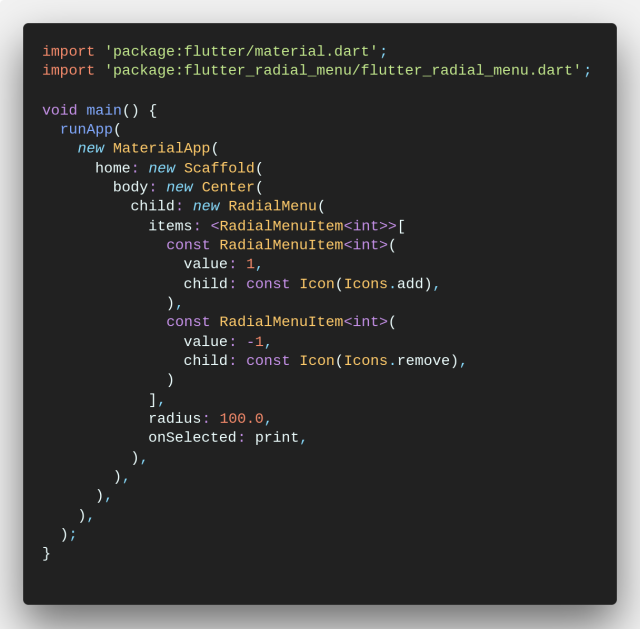

# flutter_radial_menu

A radial menu widget for Flutter.

.

## Installation

Install the latest version from pub.

## Quick Start

Import the package, create a `RadialMenu` and pass it your `RadialMenuItems`.

 

---

Take a look at the [demo](example/demo.dart) for a more elaborate example.
